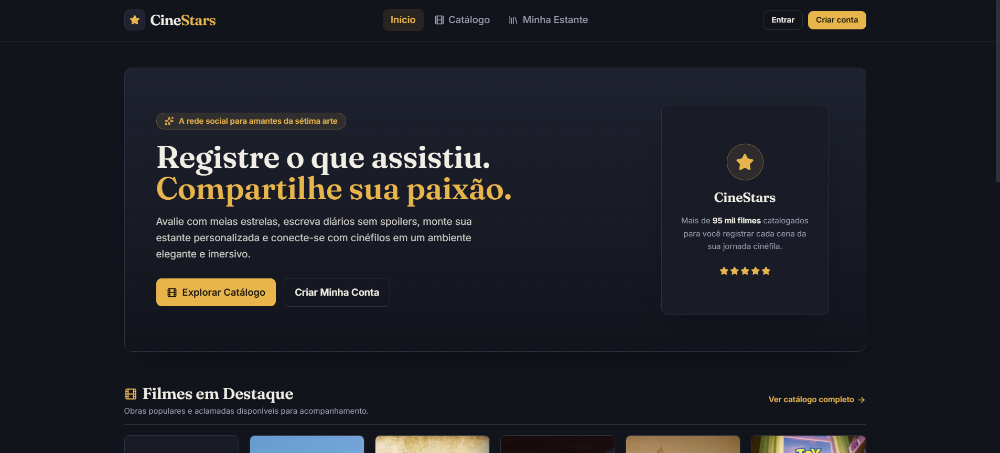
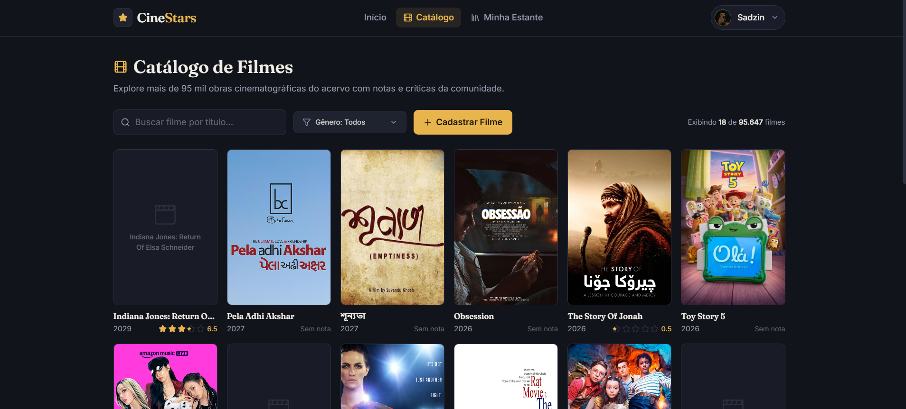
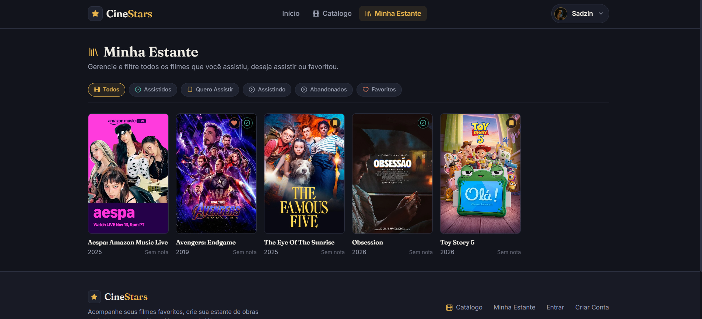
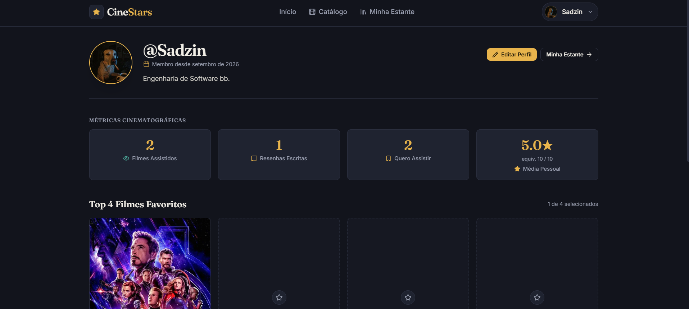
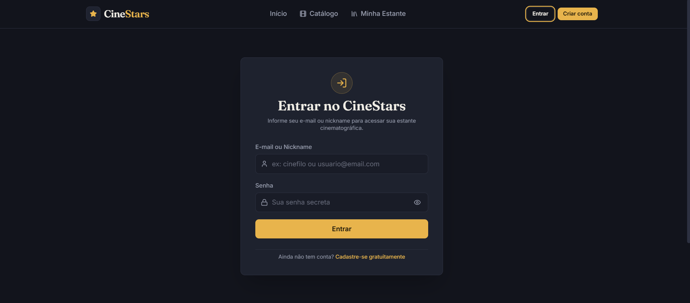
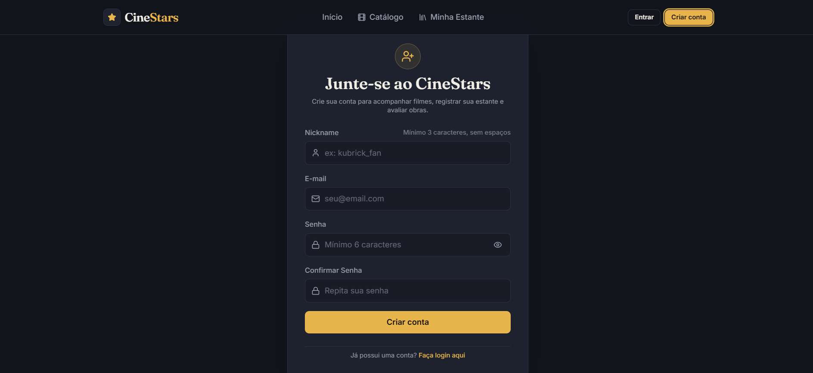

# CineStars 🎬

<p align="center">
  
  
  
  
  
  
  
  
  
  
  
  
</p>

> **Plataforma Full Stack para catalogação, tracking pessoal de filmes e rede social de resenhas cinematográficas (estilo Letterboxd), integrando um acervo analítico histórico de mais de 95 mil títulos, autenticação segura JWT e interface imersiva de alta fidelidade visual.**

<p align="center">
  
</p>

---

## 📑 Sumário

1. [Visão Arquitetural & Links Técnicos](#1-visão-arquitetural--links-técnicos)
2. [Galeria Visual da Plataforma](#2-galeria-visual-da-plataforma)
3. [Decisões de Engenharia e Regras de Negócio Críticas](#3-decisões-de-engenharia-e-regras-de-negócio-críticas)
4. [Configuração de Variáveis de Ambiente (.env)](#4-configuração-de-variáveis-de-ambiente-env)
5. [Banco de Dados, Preparação e Migrações](#5-banco-de-dados-preparação-e-migrações)
6. [Matriz de Requisitos Acadêmicos Atendidos](#6-matriz-de-requisitos-acadêmicos-atendidos)
7. [Guia Prático de Execução Passo a Passo](#7-guia-prático-de-execução-passo-a-passo)
8. [Validação Automatizada e Homologação](#8-validação-automatizada-e-homologação)

---

## 1. Visão Arquitetural & Links Técnicos

O CineStars é construído sob o paradigma de **desacoplamento total** entre cliente e servidor, unindo a velocidade assíncrona do Python moderno à reatividade declarativa do React 19:

```text
┌────────────────────────────────────────┐         REST / JSON          ┌────────────────────────────────────────┐
│           FRONTEND SPA (Vite)          │ ◄──────────────────────────► │           BACKEND API (FastAPI)        │
├────────────────────────────────────────┤   Bearer JWT Authentication  ├────────────────────────────────────────┤
│ • React 19 + TypeScript (Strict)       │                              │ • Python 3.11+ assíncrono (async/await)│
│ • Tailwind CSS (Paleta Cinematográfica)│                              │ • Vertical Slices por domínio          │
│ • TanStack Query v5 (Server State)     │                              │ • SQLAlchemy 2.0 Async (aiosqlite)     │
│ • Zustand v5 (Auth Client Session)     │                              │ • SQLite WAL Mode (Alta concorrência)  │
│ • Componentes Atômicos & Acessibilidade│                              │ • Migrações Declarativas via Alembic   │
└────────────────────────────────────────┘                              └────────────────────────────────────────┘
```

Para aprofundamento específico em cada camada, consulte as documentações dedicadas:

- 📖 [**Documentação Detalhada do Backend (`backend/README.md`)**](backend/README.md): Detalhamento do modelo híbrido relacional (*Star Schema* analítico para o acervo vs. 3NF para interações sociais), arquitetura em *Vertical Slices*, controle de concorrência ACID no SQLite WAL, segurança OWASP e especificação formal de todos os endpoints.
- 🎨 [**Documentação Detalhada do Frontend (`frontend/README.md`)**](frontend/README.md): Filosofia de separação estrita *Server State* vs. *Client State*, desmistificação dos arquivos de configuração da raiz (`postcss`, `oxlint`, `tailwind`, `vite`, `tsconfig`), anatomia do Design System e catálogo de componentes.

---

## 2. Galeria Visual da Plataforma

### 2.1. Página Inicial & Feed Comunitário
A vitrine de entrada apresenta destaques editoriais da plataforma, métricas consolidadas da comunidade em tempo real e o feed social cronológico das últimas avaliações publicadas pelos cinéfilos, com suporte a *spoiler blur* (revelação sob demanda).

<p align="center">
  
</p>

---

### 2.2. Catálogo Paginado com Busca Debounced e Filtro por Gênero
Permite navegar por dezenas de milhares de obras com amortecimento de digitação (*debounce* de 400ms), filtro dinâmico via menu dropdown de gêneros, contadores e atalho para cadastro de novas obras cinematográficas por usuários logados.

<p align="center">
  
</p>

---

### 2.3. Minha Estante (Tracking por Status e Favoritos)
Painel exclusivo do cinéfilo para gerenciar sua biblioteca pessoal através de abas interativas com os 4 status essenciais: **Assistidos**, **Quero Assistir**, **Assistindo**, **Abandonados** e a coleção de **Favoritos**.

<p align="center">
  
</p>

---

### 2.4. Perfil Social com Estatísticas e Vitrine "Top 4"
Exibição pública do cinéfilo (`/users/:nickname`) com avatar personalizado, biografia, contadores agregados em query única de alta performance, vitrine dos **Top 4 Filmes Favoritos** e as **5 avaliações mais recentes**.

<p align="center">
  
</p>

---

### 2.5. Fluxos de Autenticação Segura
Telas de autenticação com validação estrita, login híbrido (email ou nickname), mensagens de erro contextuais e proteção contra vazamento de credenciais.

<p align="center">
  
  
</p>

---

## 3. Decisões de Engenharia e Regras de Negócio Críticas

### 3.1. Controle de Acesso e Autoria no CRUD de Filmes (*Ownership Verification*)
- **O Desafio:** O acervo base do CineStars conta com mais de **95 mil títulos históricos**. Se qualquer usuário logado pudesse editar ou deletar filmes livremente, o catálogo público seria vandalizado ou corrompido.
- **A Solução:**
  1. Todo filme cadastrado por um usuário via `POST /api/v1/movies` recebe automaticamente o vínculo `created_by_user_id = current_user.id`.
  2. Os mais de 95 mil filmes legados do acervo base possuem `created_by_user_id = None`, sendo tratados como **patrimônio imutável**.
  3. No backend, os endpoints `PUT /api/v1/movies/{id}` e `DELETE /api/v1/movies/{id}` validam rigorosamente a autoria:
     ```python
     if not movie.created_by_user_id or movie.created_by_user_id != current_user_id:
         raise MoviePermissionError("Você não tem permissão para editar ou excluir este filme.")
     ```
     Tentativas não autorizadas são sumariamente rejeitadas com **`HTTP 403 Forbidden`**.
  4. No frontend (`MovieDetailPage.tsx`), os botões de **"Editar Filme"** e **"Excluir Filme"** utilizam renderização condicional estrita (`isOwner = currentUser?.id === movie?.created_by_user_id`), ficando invisíveis para visitantes e outros usuários.

### 3.2. Harmonização da Escala de Avaliação (5 Estrelas vs. 10 Níveis)
- **A Convergência:** O CineStars adota a filosofia da comunidade cinéfila global (como no Letterboxd):
  - A interface exibe visualmente **estrelas de 0.5 a 5.0** com suporte a meias-estrelas (estrelas cheias e meias-estrelas).
  - Matematicamente, essa faixa fracionada em passos de `0.5` mapeia **exatamente 10 níveis discretos de pontuação**:
    $$\text{Nota na Escala de 10} = \text{Estrelas} \times 2$$
  - No `ReviewModal.tsx`, o usuário dispõe de uma régua intuitiva com os 10 botões clicáveis (`1 a 10` e `0.5★ a 5.0★`), eliminando ambiguidades.
  - O backend valida a nota via validador matemático Pydantic: `(rating * 2) % 1 == 0`, rejeitando frações não homologadas com `422 Unprocessable Entity`.

### 3.3. Regra de Negócio: Auto-Watched na Avaliação
- Ao submeter uma crítica ou avaliação (`POST /api/v1/movies/{id}/reviews`), o serviço do backend executa uma transação coordenada: registra a avaliação e **promove automaticamente o filme para o status `ASSISTIDO`** na estante do usuário. Não é concebível que um cinéfilo avalie formalmente uma obra sem tê-la assistido.

### 3.4. Desenvolvimento Guiado por Especificações e Agentes de IA
- A pasta `backend/docs/` serviu como **especificação viva de engenharia** consumida iterativamente por Agentes Autônomos de IA (Antigravity).
- Cada módulo passou por rodadas de auditoria automatizada de segurança e arquitetura em modo *read-only*, com posterior triagem crítica humana para expurgar bugs (como escape de curingas no SQLite e limites defensivos de strings) e prevenir *overengineering*.

---

## 4. Configuração de Variáveis de Ambiente (.env)

A aplicação segue estritamente as diretrizes do **12-Factor App**, isolando configurações de infraestrutura em arquivos `.env` ignorados pelo Git.

### 4.1. Backend (`backend/.env`)

Crie o arquivo `backend/.env` copiando o modelo de exemplo:

```bash
cp backend/.env.example backend/.env
```

Configuração recomendada para desenvolvimento local:

```ini
# Ambiente de execução e metadados
ENVIRONMENT=local
PROJECT_NAME="CineStars API"
PROJECT_VERSION=2026.2
LOG_LEVEL=INFO

# Banco de Dados Assíncrono (SQLite em modo WAL)
DATABASE_URL=sqlite+aiosqlite:///./rocketlab.db

# Origens permitidas para CORS (Frontend Vite e portas comuns)
BACKEND_CORS_ORIGINS=["http://localhost:5173", "http://127.0.0.1:5173", "http://localhost:3000", "http://127.0.0.1:3000"]

# Chave Criptográfica JWT (HS256 - 32 bytes hexadecimais)
SECRET_KEY=9a3f4e2b8c1d5f6a7b8c9d0e1f2a3b4c5d6e7f8a9b0c1d2e3f4a5b6c7d8e9f0a
```

> [!TIP]
> Para gerar uma chave criptográfica inédita para o `SECRET_KEY`, execute no terminal:
> ```bash
> python -c "import secrets; print(secrets.token_hex(32))"
> ```

---

### 4.2. Frontend (`frontend/.env`)

Crie o arquivo `frontend/.env` copiando o modelo de exemplo:

```bash
cp frontend/.env.example frontend/.env
```

Configuração necessária:

```ini
# URL base da API FastAPI com o prefixo /api/v1
VITE_API_BASE_URL=http://127.0.0.1:8000/api/v1
```

---

## 5. Banco de Dados, Preparação e Migrações

O CineStars armazena seus dados em uma base relacional **SQLite** otimizada com **WAL Mode (*Write-Ahead Logging*)**, permitindo leituras concorrentes ultrarrápidas simultâneas a operações de escrita sem contenção de lock.

### 5.1. Execução de Migrações (Alembic)
Para criar a estrutura de tabelas, chaves estrangeiras com exclusão em cascata e índices analíticos:

```bash
# Estando dentro do diretório backend:
alembic upgrade head
```

Para verificar se a base está 100% em paridade com os modelos declarativos do SQLAlchemy:
```bash
alembic check
# Saída esperada: No new upgrade operations detected.
```

### 5.2. Povoamento do Acervo de 95 Mil Filmes (*Seed Scripts*)
Caso esteja iniciando uma base limpa a partir do zero, popule as tabelas dimensionais e métricas analíticas a partir dos CSVs localizados em `data/`:

```bash
# 1. Popula dimensões básicas (filmes, gêneros, pessoas, produtoras)
python -m scripts.seed1

# 2. Popula pontes relacionais N:N e resumos de performance
python -m scripts.seed2
```

---

## 6. Matriz de Requisitos Acadêmicos Atendidos

Todos os requisitos do projeto foram integralmente satisfeitos e homologados:

| Requisito Funcional | Status | Onde Testar na Interface | Endpoint HTTP Correspondente |
| :--- | :---: | :--- | :--- |
| **Cadastro de Conta com Validações** | ✅ **100%** | `/register` | `POST /api/v1/auth/register` |
| **Login Híbrido (Email ou Nickname)** | ✅ **100%** | `/login` | `POST /api/v1/auth/login` |
| **Sessão do Usuário Logado** | ✅ **100%** | Header / Navbar | `GET /api/v1/auth/me` |
| **Edição de Perfil (Bio e Foto)** | ✅ **100%** | `/users/:nickname` (Modal Editar Perfil) | `PATCH /api/v1/users/me` |
| **Perfil com Métricas e Top 4** | ✅ **100%** | `/users/:nickname` | `GET /api/v1/users/{nickname}` |
| **Catálogo Paginado com Busca e Gênero**| ✅ **100%** | `/movies` | `GET /api/v1/movies` |
| **Cadastro de Filme no Catálogo** | ✅ **100%** | `/movies` (Botão "+ Cadastrar Filme") | `POST /api/v1/movies` |
| **Ficha Técnica Detalhada do Filme** | ✅ **100%** | `/movies/:id` | `GET /api/v1/movies/{id}` |
| **Edição de Filme (Apenas o Criador)** | ✅ **100%** | `/movies/:id` (Botão "Editar Filme") | `PUT /api/v1/movies/{id}` |
| **Exclusão de Filme (Apenas o Criador)**| ✅ **100%** | `/movies/:id` (Botão "Excluir Filme") | `DELETE /api/v1/movies/{id}` |
| **Tracking com os 4 Status da Estante** | ✅ **100%** | `/movies/:id` e `/library` | `PUT /api/v1/movies/{id}/status` |
| **Consulta de Biblioteca Pessoal** | ✅ **100%** | `/library` (Minha Estante) | `GET /api/v1/movies/me/library` |
| **Avaliação com Regra Auto-Watched** | ✅ **100%** | `/movies/:id` (Modal "Avaliar") | `POST /api/v1/movies/{id}/reviews` |
| **Listagem Paginada de Resenhas** | ✅ **100%** | `/movies/:id` (Seção Resenhas) | `GET /api/v1/movies/{id}/reviews` |
| **Exclusão da Própria Resenha** | ✅ **100%** | `/movies/:id` (Ícone de lixeira no card) | `DELETE /api/v1/movies/{id}/reviews` |
| **Feed Social Global da Comunidade** | ✅ **100%** | `/` (Home Page) | `GET /api/v1/feed` |

---

## 7. Guia Prático de Execução Passo a Passo

Siga as instruções abaixo para rodar a aplicação completa localmente em poucos minutos:

### Pré-requisitos
- **Git** instalado.
- **Python 3.11** ou superior instalado.
- **Node.js 20** ou superior (com **npm**) instalado.

---

### Passo 1: Configuração e Execução do Backend

Abra um terminal dedicado para o backend:

```bash
# 1. Navegue até o diretório do backend
cd backend

# 2. Crie e ative o ambiente virtual
# No Windows (PowerShell):
python -m venv .venv
.\.venv\Scripts\Activate.ps1

# No Linux / macOS:
# python3 -m venv .venv && source .venv/bin/activate

# 3. Atualize o pip e instale as dependências
pip install --upgrade pip
pip install -e ".[dev]"

# 4. Configure o arquivo de variáveis de ambiente
cp .env.example .env

# 5. Aplique as migrações no banco SQLite
alembic upgrade head

# 6. Inicie o servidor FastAPI com recarregamento dinâmico
uvicorn app.main:app --reload --host 127.0.0.1 --port 8000
```

> O backend estará disponível em `http://127.0.0.1:8000`. A documentação interativa Swagger pode ser acessada em `http://127.0.0.1:8000/docs`.

---

### Passo 2: Configuração e Execução do Frontend

Abra um **segundo terminal** dedicado para o frontend:

```bash
# 1. Navegue até o diretório do frontend
cd frontend

# 2. Instale as dependências do ecossistema Node
npm install

# 3. Configure o arquivo de variáveis de ambiente
cp .env.example .env

# 4. Inicie o servidor de desenvolvimento do Vite
npm run dev
```

> O frontend estará rodando em `http://localhost:5173`. Acesse o link no seu navegador.

---

### 🔑 Credenciais para Teste Rápido

Para testar a experiência completa imediatamente com um perfil rico em filmes assistidos, resenhas e favoritos já cadastrados:

- **Login (Nickname):** `tarkovsky_fan`
- **Senha:** `cinema123`

*(Você também pode registrar uma conta do zero na tela `/register`)*.

---

## 8. Validação Automatizada e Homologação

Para comprovar formalmente a integridade de engenharia de todo o sistema:

### 8.1. Testes Automatizados no Backend (Pytest)
No terminal do backend (com o ambiente virtual ativo):

```bash
cd backend
pytest -v
```

**Resultado:**
```text
============================= test session starts =============================
platform win32 -- Python 3.13.5, pytest-9.1.1, pluggy-1.6.0
collected 20 items

tests/test_app.py::test_health_check PASSED                              [  5%]
tests/test_auth.py::test_register_user_success PASSED                    [ 10%]
tests/test_auth.py::test_register_duplicate_email_or_nickname PASSED     [ 15%]
tests/test_auth.py::test_hybrid_login PASSED                             [ 20%]
tests/test_auth.py::test_get_current_user_me PASSED                      [ 25%]
tests/test_auth.py::test_register_avatar_url_max_length_validation PASSED [ 30%]
tests/test_auth.py::test_update_profile_partial_bio_only PASSED          [ 35%]
tests/test_auth.py::test_update_profile_partial_avatar_only PASSED       [ 40%]
tests/test_auth.py::test_update_profile_empty_string_sanitized_to_none PASSED [ 45%]
tests/test_models.py::test_movie_schema_registers_expected_tables PASSED [ 50%]
tests/test_models.py::test_movie_review_columns_match_shared_csv PASSED  [ 55%]
tests/test_movies_crud.py::test_create_movie_lifecycle PASSED            [ 60%]
tests/test_movies_crud.py::test_movie_ownership_restrictions PASSED      [ 65%]
tests/test_reviews.py::test_create_review_and_auto_mark_watched PASSED   [ 70%]
tests/test_reviews.py::test_review_validation_half_star PASSED           [ 75%]
tests/test_reviews.py::test_delete_review_lifecycle PASSED               [ 80%]
tests/test_tracking.py::test_update_movie_status_and_read PASSED         [ 85%]
tests/test_tracking.py::test_filter_library PASSED                       [ 90%]
tests/test_users_feed.py::test_get_public_profile_with_stats PASSED      [ 95%]
tests/test_users_feed.py::test_global_community_feed PASSED              [100%]

============================= 20 passed in 8.30s ==============================
```

---

### 8.2. Checagem de Tipagem e Build de Produção no Frontend
No terminal do frontend:

```bash
cd frontend

# Checagem estática estrita de tipos TypeScript (sem erros)
npx tsc --noEmit

# Análise de lint ultrarrápida com Oxlint
npm run lint

# Build de produção com Vite
npm run build
```

**Resultado:**
```text
✓ 2042 modules transformed.
dist/index.html                   1.08 kB │ gzip:   0.59 kB
dist/assets/index-wkv0k6a9.css   29.94 kB │ gzip:   6.37 kB
dist/assets/index-CX85TRof.js   612.52 kB │ gzip: 181.61 kB
✓ built in 1.41s
```

---

<p align="center">
  <sub>Desenvolvido com excelência técnica e paixão pela sétima arte • CineStars 2026</sub>
</p>
