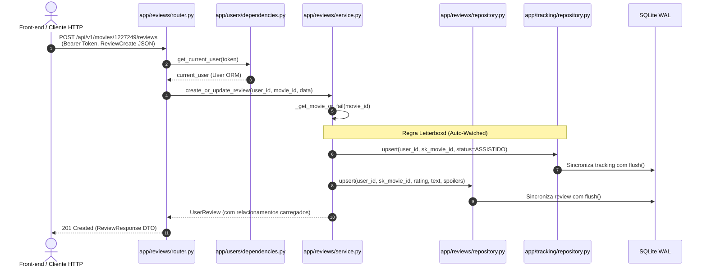

# CineStars Backend — Engenharia & Arquitetura

<p align="center">
  
  
  
  
  
  
  
  
</p>

> **API assíncrona de alta performance para catálogo cinematográfico, estante pessoal e rede social de cinéfilos (clone Letterboxd), estruturada sobre monólito modular (*Vertical Slices*), persistência híbrida e validação estrita de contratos.**

---

## Sumário
1. [Visão Geral & Decisões Arquiteturais Fundamentais](#1-visão-geral--decisões-arquiteturais-fundamentais)
2. [Anatomia de uma Feature: O Ciclo de Vida do Módulo (Estudo de Caso)](#2-anatomia-de-uma-feature-o-ciclo-de-vida-do-módulo-estudo-de-caso)
3. [O Motor de Migrações: Como o Alembic Opera no Projeto](#3-o-motor-de-migrações-como-o-alembic-opera-no-projeto)
4. [O Papel dos Agentes de IA, Auditorias e a Linha Anti-Overengineering](#4-o-papel-dos-agentes-de-ia-auditorias-e-a-linha-anti-overengineering)
5. [Matriz de Contratos da API](#5-matriz-de-contratos-da-api)
6. [Gestão de Configurações (12-Factor App)](#6-gestão-de-configurações-12-factor-app)
7. [Guia Passo a Passo de Onboarding ("Do Zero ao Servidor Rodando")](#7-guia-passo-a-passo-de-onboarding-do-zero-ao-servidor-rodando)
8. [Garantia de Qualidade & Testes Automatizados](#8-garantia-de-qualidade--testes-automatizados)

---

## 1. Visão Geral & Decisões Arquiteturais Fundamentais

O CineStars é uma plataforma concebida para a experiência de cinéfilos: navegação por um catálogo extenso de filmes com elenco e métricas consolidadas, gestão de estante de filmes assistidos/favoritos e compartilhamento social de resenhas e avaliações com notas fracionadas (meias estrelas).

Para sustentar essas necessidades sem complexidade acidental, a aplicação adota dois pilares de design:

### 1.1. Coexistência Híbrida: Catálogo Analítico (OLAP) vs. Interações Sociais (OLTP)

Um dos pontos mais singulares da arquitetura do CineStars é a convivência harmônica entre duas modelagens relacionais com naturezas distintas no mesmo banco:

```text
┌────────────────────────────────────────────────────────┐
│                   PERSISTÊNCIA HÍBRIDA                 │
├───────────────────────────┬────────────────────────────┤
│   CATÁLOGO ANALÍTICO      │    REDE SOCIAL & TRACKING  │
│      (Star Schema)        │    (3NF Transacional Puro) │
├───────────────────────────┼────────────────────────────┤
│ • DimMovie, DimGenre      │ • User                     │
│ • DimPerson, DimCompany   │ • UserMovieTracking        │
│ • FactMoviePerformance    │ • UserReview               │
│ • bridge_movie_* (N:N)    │                            │
├───────────────────────────┼────────────────────────────┤
│ Leitura pesada, dimensional,│ Escrita concorrente ACID, │
│ volumetria histórica estável│ integridade com FK cascade│
└───────────────────────────┴────────────────────────────┘
```

- **O Catálogo Analítico (Star Schema)**: O domínio de filmes foi importado e estruturado a partir de bases de engenharia de dados (camada Diamond). Ele preserva dimensões desacopladas (`DimMovie`, `DimGenre`, `DimPerson`, `DimCompany`, `DimReview`) e fatos numéricos (`FactMoviePerformance`), interligadas por tabelas de junção (*bridge tables*). Essa modelagem é otimizada para queries com agregações, buscas por atributos múltiplos e preservação de metadados históricos de produção e bilheteria.
- **As Interações Sociais e Pessoais (3NF Transacional)**: Os módulos de usuários, tracking de biblioteca (`user_movie_tracking`) e resenhas (`user_reviews`) foram concebidos sob a Terceira Forma Normal clássica. Priorizam a consistência imediata, integridade referencial com Foreign Keys nativas (`ON DELETE CASCADE`), constraints de unicidade compostas (ex: `uq_user_movie_tracking`) e mutações atômicas frequentes.
- **Por que essa divisão é vantajosa?** Em vez de forçar a desnormalização das resenhas de usuários dentro de estruturas analíticas rígidas ou normalizar artificialmente um catálogo analítico de milhares de registros históricos, o sistema conecta ambos os mundos pela chave imutável do filme (`sk_movie_id`). O catálogo funciona como dimensão de consulta compartilhada, enquanto o subsistema social opera com elasticidade transacional plena.

### 1.2. Monólito Modular Pragmático (*Vertical Slices*)

Em vez da clássica divisão horizontal em camadas técnicas globais (`controllers/`, `services/`, `models/`, onde a implementação de uma única funcionalidade exige navegar por quatro pontas do repositório), o CineStars adota **Vertical Slices** (fatias verticais por domínio de negócio):

```text
backend/app/
├── api/v1/          # Barramento de composição e montagem das rotas HTTP
├── core/            # Configurações 12-factor, segurança criptográfica e logging
├── db/              # Sessão assíncrona do SQLAlchemy e Base declarativa ORM
├── movies/          # Domínio do catálogo e CRUD protegido (schemas, models, repo, service, router)
├── users/           # Domínio de identidade, perfil e autenticação (JWT, bcrypt, perfil público)
├── tracking/        # Domínio da estante pessoal (4 status de visualização e favoritos)
└── reviews/         # Domínio social (resenhas, meias estrelas, feed global e exclusão)
```

**Benefícios imediatos:**
1. **Alta Coesão e Baixo Acoplamento**: Tudo o que diz respeito a avaliações vive em `app/reviews/`. Se a regra de notas mudar, apenas este módulo é modificado.
2. **Dependência Unidirecional Clara**: Os módulos de negócio (`reviews` e `tracking`) consomem as entidades de `movies` apenas como referência de chave estrangeira e consultas de validação, sem dependência circular.
3. **Evolução Independente**: Caso um módulo demande refatoração profunda ou extração para um serviço isolado no futuro, sua fronteira já está estabelecida.

---

## 2. Anatomia de uma Feature: O Ciclo de Vida do Módulo (Estudo de Caso)

Para compreender como as fatias verticais operam no código, analisamos a anatomia completa do módulo de **Avaliações (`app/reviews`)**, com ênfase no fluxo de publicação de resenhas (`POST /api/v1/movies/{id}/reviews`):



### 2.1. O Papel dos Arquivos na Prática

- **`models.py` (Mapeamento Declarativo ORM)**:
  Declara a entidade `UserReview` com chave primária UUIDv4, chaves estrangeiras vinculadas a `users.id` e `dim_movies.sk_movie_id` (com exclusão em cascata) e constraint única `UniqueConstraint("user_id", "movie_id", name="uq_user_movie_review")`.
  - *Otimização de Índices*: Contém `index=True` explícito no campo `created_at` para viabilizar paginação ordenada em tempo $O(\log N)$ no feed global da comunidade.
  - *Eager Loading sem N+1*: Utiliza `relationship(lazy="selectin")` para carregar `user` e `movie` em subconsultas eficientes por ID, eliminando consultas repetidas em loops de serialização.

- **`schemas.py` (Contratos e DTOs Pydantic)**:
  Contém as definições de entrada (`ReviewCreate`) e saída (`ReviewResponse`, `MovieReviewListResponse`, `PaginatedFeedResponse`).
  - *Validação Fracionada*: Implementa validação da escala Letterboxd através do `@field_validator("rating")`, garantindo que notas inválidas (como `4.3`) sejam rejeitadas com status `422 Unprocessable Entity`:
    ```python
    if (v * 2) % 1 != 0:
        raise ValueError("A nota deve ser em incrementos de 0.5 estrela (ex: 3.0, 3.5, 4.0).")
    ```
  - *Cálculo de Páginas*: Utiliza `@computed_field` com `math.ceil` para fornecer `total_pages` dinamicamente a partir de `total` e `per_page`.
  - *Paridade Estrita com o Banco*: Limite defensivo em `review_text: str | None = Field(default=None, max_length=5000)`.

- **`repository.py` (Persistência e SQL Parametrizado)**:
  Encapsula toda a interação com o SQLAlchemy AsyncSession. Não contém regras de negócio.
  - *Atomicidade com `flush()`*: O método `upsert` realiza a busca pelo par `(user_id, movie_id)`. Se o registro existir, atualiza suas propriedades; se não, instancia um novo `UserReview`. Em ambos os casos, invoca `await self.db.flush()`, garantindo que o ID e as alterações estejam disponíveis na transação sem comitar prematuramente a sessão externa.

- **`service.py` (Orquestração e Regras de Negócio)**:
  Recebe os repositórios injetados (`ReviewRepository`, `MovieRepository`, `TrackingRepository`) e implementa a lógica do domínio:
  - *A Regra Letterboxd (Auto-Watched)*: Ao criar ou editar uma resenha, o serviço invoca `tracking_repository.upsert` com `status = MovieWatchStatus.ASSISTIDO`. Essa operação compartilha a mesma transação, garantindo consistência atômica: avaliar um filme significa obrigatoriamente tê-lo assistido.
  - *Resolução Transparente de Identificador*: Através do helper interno `_get_movie_or_fail`, converte tanto o ID numérico natural (`id_filme`, ex: `"1227249"`) quanto o surrogate hash (`sk_movie_id`) para a entidade correspondente antes da gravação.

- **`router.py` (Transporte HTTP & Injeção de Dependências)**:
  Expõe os endpoints RESTful, anota tipos de resposta para geração automática da especificação OpenAPI e injeta dependências via `FastAPI.Depends`:
  - `current_user: User = Depends(get_current_user)` garante que requisições mutáveis operem estritamente sobre a identidade autenticada, inviabilizando qualquer vetor de IDOR (*Insecure Direct Object Reference*).

> [!NOTE]
> **Por que `app/users` e `app/movies` implementam seus próprios `exceptions.py` isolados?**
> No módulo de identidade (`app/users`), conflitos semânticos como duplicidade de e-mail ou nickname (`UserAlreadyExistsError`) e credenciais incorretas (`InvalidCredentialsError`) demandam status codes HTTP específicos (`409 Conflict` e `401 Unauthorized`).
> No módulo de filmes (`app/movies`), violações de autoria (`MoviePermissionError`) demandam retorno `403 Forbidden`. O FastAPI captura essas exceções de domínio através de handlers centralizados em `app/main.py`, mantendo a camada HTTP limpa e defensiva.

---

## 3. O Motor de Migrações: Como o Alembic Opera no Projeto

O ciclo de evolução de banco de dados do CineStars é 100% governado pelo **Alembic**, operando sobre SQLite local com o driver assíncrono `aiosqlite`.

```text
┌─────────────────┐       Lê DATABASE_URL        ┌─────────────────┐
│   backend/.env  │ ───────────────────────────> │ app/core/config │
└─────────────────┘                              └────────┬────────┘
                                                          │ get_settings()
                                                          ▼
┌─────────────────┐       replace('+aiosqlite')  ┌─────────────────┐
│   alembic.ini   │ <─────────────────────────── │migrations/env.py│
└─────────────────┘       Configura URL síncrona └────────┬────────┘
                                                          │ target_metadata
                                                          ▼
┌──────────────────────────────────────────────────────────────────┐
│ Base.metadata (Movies, Users, Tracking, Reviews)                │
└──────────────────────────────────────────────────────────────────┘
```

### 3.1. Arquitetura do `alembic.ini` e `migrations/env.py`
- **Interpolação de Caminho no `alembic.ini`**: O arquivo utiliza a variável de interpolação `script_location = %(here)s/migrations`, garantindo que os scripts sejam localizados corretamente independentemente de o comando ser disparado a partir da raiz do repositório ou de dentro da pasta `backend/`.
- **A Ponte Assíncrono -> Síncrono no `env.py`**:
  O Alembic executa suas migrações em um runner síncrono padrão do SQLAlchemy. No entanto, a aplicação é puramente assíncrona (`sqlite+aiosqlite://`). Para resolver esse descasamento de forma transparente, o arquivo `migrations/env.py` extrai a string de conexão configurada em runtime e remove o protocolo assíncrono:
  ```python
  database_url = get_settings().database_url.replace("+aiosqlite", "")
  config.set_main_option("sqlalchemy.url", database_url)
  ```
- **Unificação de Metadados**: O `env.py` importa todos os modelos dos quatro módulos verticais (`movies`, `users`, `tracking`, `reviews`) para registrar suas declarações em `Base.metadata`. Dessa forma, o Alembic conhece todas as tabelas e relacionamentos do monólito.
- **Suporte a SQLite via Modo Batch (`render_as_batch=True`)**: Como o SQLite não possui suporte nativo completo para comandos `ALTER TABLE` (como alteração ou remoção de colunas e constraints existentes), o `env.py` configura `render_as_batch=True`. O Alembic cria automaticamente uma tabela temporária, copia os dados e renomeia a estrutura em modo transacional.

### 3.2. A Linha de Defesa com `alembic check`
O comando `alembic check` é parte integral da esteira de qualidade do CineStars. Ele inspeciona os modelos SQLAlchemy em memória e os compara com as tabelas físicas no banco:
```bash
alembic check
# Se houver divergência: FAILED: New upgrade operations detected
# Se estiver 100% sincronizado: No new upgrade operations detected.
```

---

## 4. O Papel dos Agentes de IA, Auditorias e a Linha Anti-Overengineering

O repositório do CineStars foi submetido a auditorias técnicas automatizadas utilizando **Agentes de IA (Antigravity)** operando como auditores de segurança e arquitetura em modo *read-only*. Os relatórios completos dessas varreduras encontram-se versionados na pasta `backend/docs/auditorias/`:
- [`RELATORIO_AUDITORIA_CINESTARS.md`](file:///c:/Users/sever/Documents/Projetos/Cinestars/backend/docs/auditorias/arquitetura/RELATORIO_AUDITORIA_CINESTARS.md): Auditoria arquitetural, validação de contratos e resíduos de desenvolvimento.
- [`RELATORIO_SEGURANCA_CINESTARS.md`](file:///c:/Users/sever/Documents/Projetos/Cinestars/backend/docs/auditorias/seguranca/RELATORIO_SEGURANCA_CINESTARS.md): Auditoria de segurança, postura criptográfica, mapeamento de IDOR e vetores OWASP.

### 4.1. A Triagem Crítica Humana (Onde Dissemos "NÃO" ao Preciosismo)

Os agentes de IA geraram apontamentos valiosos, mas foram submetidos a um processo rigoroso de **triagem humana de engenharia**. Nem todas as sugestões foram aplicadas: várias foram deliberadamente **rejeitadas** ou adaptadas para proteger a simplicidade do MVP e evitar *overengineering*:

| Recomendação da IA | Decisão de Engenharia | Justificativa do Trade-off |
| :--- | :---: | :--- |
| **Implementar biblioteca de Rate Limiting em runtime** (`slowapi` em endpoints de login) | ❌ **Rejeitado no Código** | O acoplamento de bibliotecas de rate limit em memória dentro do FastAPI gera contenção e lentidão em testes assíncronos concorrentes, além de complexidade de mock. Em arquitetura de produção moderna, rate limiting é **responsabilidade de borda** (*reverse proxy* como Nginx ou Cloudflare WAF). |
| **Implementar Blacklist / Revogação de JWT via Redis** | ❌ **Rejeitado no MVP** | O projeto opera intencionalmente como uma API **stateless JWT**. Adicionar Redis ou persistência de estado em memória apenas para controle de logout destruiria a simplicidade de infraestrutura do MVP local. Mantida expiração finita (`exp`) com tempo de vida adequado. |
| **Migração Imediata e Obrigatória para PostgreSQL** | ❌ **Rejeitado no MVP** | A persistência sobre **SQLite em modo WAL** (*Write-Ahead Logging*) com `PRAGMA foreign_keys=ON` atende com folga as necessidades de desenvolvimento local, testes determinísticos rápidos em arquivo/memória e a volumetria inicial do MVP. |
| **CRUD de Filmes Seguro com Propriedade (Ownership)** | ✅ **Implementado com Restrição Estrita** | O cadastro de filmes é permitido a usuários autenticados (`POST /movies`), gravando `created_by_user_id = current_user.id`. Modificações e exclusões (`PUT /movies/{id}` e `DELETE /movies/{id}`) validam obrigatoriamente a autoria, retornando `403 Forbidden` caso terceiros tentem alterar ou apagar obras alheias ou filmes do acervo legado. |
| **Eliminar rota destrutiva de tracking** | ✅ **Acatado** | `DELETE /movies/{id}/status` deletava a tupla física do banco, apagando incorretamente o status de favorito. Foi removida; a limpeza de status é feita via `PUT` com `"status": null`. |

---

### 4.2. Regra Crítica de Negócio: Integridade do Acervo e Controle de Autoria (*Ownership*)

O acervo do CineStars é composto por mais de **95 mil filmes históricos** herdados da base analítica original. Caso qualquer usuário logado pudesse editar ou apagar qualquer filme, a integridade global do catálogo seria irremediavelmente corrompida.

Para solucionar esse problema com máxima elegância arquitetural:

1. **Chave de Autoria (`created_by_user_id`)**:
   A tabela `dim_movies` possui a coluna `created_by_user_id` (chave estrangeira referenciando `users.id`, com `ondelete="SET NULL"` e `index=True`).
2. **Obras Legadas Protegidas**:
   Todos os filmes pré-existentes possuem `created_by_user_id = None`. Obras com autor nulo são consideradas **patrimônio imutável do acervo**, ficando blindadas contra qualquer tentativa de edição (`PUT`) ou remoção (`DELETE`).
3. **Controle de Acesso Baseado em Posse**:
   Ao cadastrar um novo filme via `POST /api/v1/movies`, o ID do usuário autenticado é persistido em `created_by_user_id`.
   Nos endpoints `PUT /api/v1/movies/{id}` e `DELETE /api/v1/movies/{id}`, o serviço executa a checagem:
   ```python
   if not movie.created_by_user_id or movie.created_by_user_id != current_user_id:
       raise MoviePermissionError("Você não tem permissão para editar ou excluir este filme.")
   ```
   Caso a condição não seja satisfeita, a API retorna imediatamente `HTTP 403 Forbidden`.

---

### 4.3. Bugs Críticos Caçados e Sanados

Graças às auditorias e à posterior intervenção corretiva, falhas silenciosas de alta severidade foram sanadas:

1. **Escape de Curingas SQL no SQLite (`app/movies/repository.py`)**:
   - *Problema*: O código realizava `.replace("%", r"\%").replace("_", r"\_")`, mas passava a string para `DimMovie.titulo.ilike(f"%{escaped_search}%")` sem o parâmetro `escape`. No dialeto SQLite, a contrabarra é tratada como caractere literal e não de escape.
   - *Solução*: Adicionado o parâmetro explícito: `DimMovie.titulo.ilike(f"%{escaped_search}%", escape="\\\\")`.
2. **Paridade de Limites Schema vs. Banco (`app/users/schemas.py`)**:
   - *Problema*: A coluna `users.avatar_url` foi declarada como `String(500)` no banco. No entanto, o schema `UserCreate` aceitava `avatar_url: str | None = None` sem teto de caracteres, gerando `500 Internal Server Error` no SQLite em URLs longas.
   - *Solução*: Ajustado para `avatar_url: str | None = Field(default=None, max_length=500)` e criado teste de regressão assegurando retorno estrito `422 Unprocessable Entity`.
3. **Sanitização de Strings Vazias na Edição de Perfil (`app/users/schemas.py`)**:
   - *Problema*: Ao atualizar apenas a bio ou apenas a foto de perfil, formulários enviavam `""` (string vazia), gerando rejeição `422 Unprocessable Entity` por validações estritas de URL.
   - *Solução*: Adicionado validador `@field_validator("avatar_url")` que converte automaticamente strings vazias em `None`, persistindo apenas alterações reais via `await db.commit()` e `await db.refresh(db_user)`.
4. **Case-Insensitive Nickname Resolution no SQLite (`app/users/repository.py`)**:
   - *Problema*: O SQLite trata strings em comparações diretas de forma case-sensitive. Se a rota solicitasse `/users/cinefilo` mas o registro estivesse salvo como `Cinefilo`, o perfil retornava 404.
   - *Solução*: Ajustada a consulta para `func.lower(User.nickname) == nickname.strip().lower()`.
5. **Mitigação Comprovada de IDOR (Insecure Direct Object Reference)**:
   - Todas as operações em `app/tracking`, `app/reviews` e `app/movies` (mutações) amarram a propriedade dos dados exclusivamente ao `current_user.id` do token JWT validado.

---

## 5. Matriz de Contratos da API

Abaixo está o mapeamento exato de todos os endpoints homologados e em conformidade no CineStars Backend:

| Método | Rota | Autenticação | Status Sucesso | Status Erro | Propósito & Regras de Negócio |
| :---: | :--- | :---: | :---: | :---: | :--- |
| `POST` | `/api/v1/auth/register` | Pública | `201 Created` | `409`, `422` | Cria nova conta. Unicidade de `email` e `nickname` retorna `409 Conflict`. Senha cortada em 72 bytes para bcrypt. |
| `POST` | `/api/v1/auth/login` | Pública | `200 OK` | `401`, `422` | **Login Híbrido**: aceita email ou nickname via cláusula `or_()`. Retorna Bearer JWT. |
| `GET` | `/api/v1/auth/me` | Bearer Token | `200 OK` | `401` | Retorna os dados da conta logada (`UserResponse`) sem expor hashes de senha. |
| `PATCH` | `/api/v1/users/me` | Bearer Token | `200 OK` | `401`, `422` | **Edição Parcial de Perfil**: atualiza `bio` e `avatar_url` de forma independente. Sanitiza `""` para `None`. Também disponível via `PUT /users/me` e `PATCH /auth/me`. |
| `GET` | `/api/v1/users/{nickname}` | Pública | `200 OK` | `404` | **Perfil Público O(1)**: busca case-insensitive, métricas analíticas (`stats`: total assistido, reviews, watchlist, favoritos e média pessoal), Top 4 filmes favoritos (`favorite_movies`) e 5 últimas resenhas (`recent_reviews`). |
| `GET` | `/api/v1/movies` | Pública | `200 OK` | `422` | Catálogo geral com paginação (`page`, `page_size` max 100), busca imune a injeção (`search`), **filtro opcional por gênero (`genre`)** e *eager loading* de gêneros. |
| `POST` | `/api/v1/movies` | Bearer Token | `201 Created` | `401`, `422` | **Cadastro de Filme**: cadastra novo título com metadados, diretor e gêneros, vinculando automaticamente a autoria em `created_by_user_id = current_user.id`. |
| `GET` | `/api/v1/movies/{id}` | Pública | `200 OK` | `404` | Detalhes do filme. **Resolução Transparente de ID**: aceita tanto o ID natural (`1227249`) quanto o hash `sk_movie_id`. Retorna `generos`, `diretor` e `created_by_user_id`. |
| `PUT` | `/api/v1/movies/{id}` | Bearer Token | `200 OK` | `401`, `403`, `404`, `422` | **Edição de Filme (Restrita por Autoria)**: atualiza dados cadastrais. Retorna `403 Forbidden` caso a obra pertença ao acervo legado ou a outro usuário. |
| `DELETE` | `/api/v1/movies/{id}` | Bearer Token | `204 No Content` | `401`, `403`, `404` | **Exclusão de Filme (Restrita por Autoria)**: remove obra do acervo em cascata. Retorna `403 Forbidden` caso a obra pertença ao acervo legado ou a outro usuário. |
| `PUT` | `/api/v1/movies/{id}/status` | Bearer Token | `200 OK` | `401`, `404`, `422` | **Upsert Semântico de Estante**: atualiza os 4 status (`ASSISTIDO`, `QUERO_ASSISTIR`, `ASSISTINDO`, `ABANDONEI`) e favorito (`is_favorite`). Suporta `"status": null` para limpar status mantendo favorito. |
| `GET` | `/api/v1/movies/{id}/my-status` | Bearer Token | `200 OK` | `401`, `404` | Consulta o status e favorito do usuário ativo para o filme em questão (ou `null`). |
| `GET` | `/api/v1/movies/me/library` | Bearer Token | `200 OK` | `401`, `422` | **Biblioteca Pessoal Enriquecida**: lista filmes salvos pelo cinéfilo com filtros por `status` e `favorites`, trazendo metadados do card (`titulo`, `url_poster`, `ano_lancamento`) sem consultas N+1. |
| `POST` | `/api/v1/movies/{id}/reviews` | Bearer Token | `201 Created` | `401`, `404`, `422` | **Regra Auto-Watched**: publica/edita resenha, valida nota de 0.5 a 5.0 (10 níveis em meias estrelas) e marca o filme automaticamente como `ASSISTIDO`. |
| `GET` | `/api/v1/movies/{id}/reviews` | Pública | `200 OK` | `404`, `422` | Lista resenhas do filme com paginação (`page`, `per_page`), spoiler warning e cálculo da nota média da comunidade (`average_community_rating`). |
| `GET` | `/api/v1/movies/{id}/reviews/me` | Bearer Token | `200 OK` | `401`, `404` | Retorna a resenha escrita pelo usuário ativo para o filme, ou `null` se não avaliado. |
| `DELETE` | `/api/v1/movies/{id}/reviews` | Bearer Token | `204 No Content` | `401`, `404` | Remove a resenha do usuário ativo. Retorna `404 Not Found` caso o usuário tente deletar uma resenha inexistente ou de terceiro. |
| `GET` | `/api/v1/feed` | Pública | `200 OK` | `422` | **Feed Social Global**: linha do tempo ordenada por `created_at DESC` com suporte a índice B-Tree, paginação e *selectinload* de autores e pôsteres. Compatível com `/reviews/community/feed`. |
| `GET` | `/health` | Pública | `200 OK` | — | Probe de saúde operacional com verificação de cabeçalhos de segurança OWASP. |

---

## 6. Gestão de Configurações (12-Factor App)

O módulo de configurações (`app/core/config.py`) implementa as diretrizes do **12-Factor App**, aplicando tipagem forte com `pydantic-settings` e segregando rigorosamente constantes de negócio de variáveis de ambiente sensíveis:

```python
class Settings(BaseSettings):
    model_config = SettingsConfigDict(env_file=".env", env_file_encoding="utf-8", extra="ignore")

    # Constantes da aplicação (defaults seguros no código)
    project_name: str = "CineStars API"
    project_version: str = "2026.2"
    environment: str = "local"
    api_v1_prefix: str = "/api/v1"
    algorithm: str = "HS256"
    log_level: str = "INFO"
    access_token_expire_minutes: int = 60 * 24

    # Variáveis de infraestrutura e segredo (obrigatórias via .env)
    database_url: str
    backend_cors_origins: list[str]
    secret_key: str
```

### 6.1. Boas Práticas Adotadas
1. **Zero Segredos Hardcoded no Git**: `SECRET_KEY`, `DATABASE_URL` e `BACKEND_CORS_ORIGINS` não possuem fallbacks com valores de produção vulneráveis no repositório. O arquivo `.env` é explicitamente ignorado pelo `.gitignore`.
2. **Template Documentado**: O arquivo `.env.example` serve como documentação de contrato para desenvolvedores e novos ambientes de deploy.
3. **Geração de Chave Criptográfica Legítima**:
   Para gerar uma chave secreta compatível com o algoritmo HS256 (32 bytes / 64 caracteres hexadecimais), utilize o utilitário nativo do Python:
   ```bash
   python -c "import secrets; print(secrets.token_hex(32))"
   ```

---

## 7. Guia Passo a Passo de Onboarding ("Do Zero ao Servidor Rodando")

Siga o roteiro abaixo para clonar, configurar e executar a aplicação em ambiente de desenvolvimento local a partir do zero:

### Passo 1: Clonar o Repositório e Criar o Ambiente Virtual

<details open>
<summary><b>PowerShell (Windows)</b></summary>

```powershell
# 1. Navegue até o diretório do backend
cd backend

# 2. Crie o ambiente virtual com Python 3.11 ou superior
python -m venv .venv

# 3. Ative o ambiente virtual
.\.venv\Scripts\Activate.ps1

# 4. Atualize o pip e instale o pacote em modo editável com as dependências de dev
python -m pip install --upgrade pip
pip install -e ".[dev]"
```
</details>

<details>
<summary><b>Bash (Linux / macOS)</b></summary>

```bash
# 1. Navegue até o diretório do backend
cd backend

# 2. Crie o ambiente virtual
python3 -m venv .venv

# 3. Ative o ambiente virtual
source .venv/bin/activate

# 4. Atualize o pip e instale o pacote com dependências de dev
pip install --upgrade pip
pip install -e ".[dev]"
```
</details>

### Passo 2: Configuração das Variáveis de Ambiente

Crie o arquivo `.env` a partir do template disponibilizado:

```bash
cp .env.example .env
```

Abra o arquivo `.env` e confirme as variáveis:
```ini
ENVIRONMENT=local
PROJECT_NAME="CineStars API"
PROJECT_VERSION=2026.2
DATABASE_URL=sqlite+aiosqlite:///./rocketlab.db
BACKEND_CORS_ORIGINS=["http://localhost:5173", "http://127.0.0.1:5173", "http://localhost:3000", "http://127.0.0.1:3000"]
LOG_LEVEL=INFO
SECRET_KEY=sua_chave_criptografica_gerada_aqui
```

> [!TIP]
> Gere sua própria chave de autenticação executando:
> `python -c "import secrets; print(secrets.token_hex(32))"` e cole-a no campo `SECRET_KEY`.

### Passo 3: Migrações e Povoamento Inicial do Banco (Passo Crítico)

> [!IMPORTANT]
> **ATENÇÃO:** O comando `alembic upgrade head` cria unicamente a estrutura relacional de tabelas vazias no SQLite. Caso a base `rocketlab.db` esteja limpa ou seja recriada do zero, é **mandatório** rodar sequencialmente os scripts de seed para carregar os milhares de filmes, gêneros e créditos reais a partir dos CSVs da pasta `data/`:

```bash
# 1. Aplica o histórico de revisões do Alembic
alembic upgrade head

# 2. Popula as tabelas dimensionais (gêneros, filmes, pessoas, produtoras) a partir de data/bases_atv_dev1
python -m scripts.seed1

# 3. Popula as pontes relacionais N:N e métricas analíticas a partir de data/bases_atv_dev_2
python -m scripts.seed2
```

### Passo 4: Executar a Aplicação com Uvicorn

Inicie o servidor de desenvolvimento assíncrono com recarregamento dinâmico (*hot-reload*):

```bash
uvicorn app.main:app --reload --host 0.0.0.0 --port 8000
```

### Passo 5: Interfaces Interativas e Documentação Automática

Com o servidor rodando, acesse os endpoints nos seguintes endereços:

| Interface | URL Local | Descrição |
| :--- | :--- | :--- |
| **Swagger UI** | [http://localhost:8000/docs](http://localhost:8000/docs) | Interface interativa OpenAPI para teste direto de requisições. |
| **ReDoc** | [http://localhost:8000/redoc](http://localhost:8000/redoc) | Documentação técnica visual com especificação formal de modelos. |
| **Health Check** | [http://localhost:8000/health](http://localhost:8000/health) | Probe de liveness que valida inicialização e headers de segurança. |

---

## 8. Garantia de Qualidade & Testes Automatizados

A estabilidade e integridade da aplicação são asseguradas por uma suíte completa de **20 testes assíncronos automatizados** implementada com **pytest** e **httpx**.

### 8.1. Estratégia de Isolamento com Banco em Memória
Para garantir que os testes sejam 100% determinísticos, independentes do estado do catálogo em disco e executados em milissegundos sem efeitos colaterais:
- Os testes rodam sobre `sqlite+aiosqlite:///:memory:`.
- A fixture `setup_database` (em `tests/conftest.py`) cria todas as tabelas via `Base.metadata.create_all` antes de cada função de teste e as destrói com `drop_all` ao final, utilizando `StaticPool` para manter a conexão compartilhada pela thread de teste assíncrona.
- A injeção de dependências do FastAPI (`app.dependency_overrides[get_db]`) redireciona automaticamente o tráfego do endpoint para a sessão em memória isolada.

### 8.2. Cobertura da Suíte de Testes (20/20 Testes Verdes)

A suíte cobre exaustivamente os fluxos críticos de negócio, regras de autoria e segurança:

1. **Infraestrutura**:
   - `test_health_check`: Valida a resposta do endpoint `/health` e a injeção dos headers de segurança OWASP (`nosniff` e `DENY`).
2. **Autenticação, Contas & Atualização de Perfil**:
   - `test_register_user_success`: Registro de cinéfilo com proteção contra vazamento de hash de senha.
   - `test_register_duplicate_email_or_nickname`: Rejeição com status `409 Conflict` para duplicidades.
   - `test_hybrid_login`: Login híbrido tanto por email quanto por nickname, validando a emissão de token JWT.
   - `test_get_current_user_me`: Resolução da identidade do usuário autenticado a partir do token.
   - `test_register_avatar_url_max_length_validation`: Teste de regressão assegurando retorno `422` caso `avatar_url` exceda 500 caracteres.
   - `test_update_profile_partial_bio_only`: Atualização parcial salvando unicamente a biografia do cinéfilo.
   - `test_update_profile_partial_avatar_only`: Atualização parcial salvando unicamente a URL da foto de perfil.
   - `test_update_profile_empty_string_sanitized_to_none`: Sanitização automática convertendo strings vazias (`""`) em `None`.
3. **Modelos & Schemas Relacionais**:
   - `test_movie_schema_registers_expected_tables`: Validação de registro de todas as tabelas dimensionais e transacionais no catálogo do SQLAlchemy.
   - `test_movie_review_columns_match_shared_csv`: Conformidade dos nomes e tipos de colunas com as bases analíticas.
4. **CRUD de Filmes & Controle de Autoria (Ownership)**:
   - `test_create_movie_lifecycle`: Ciclo completo de vida de cadastro, leitura, atualização e remoção de filmes pelo criador com associação de diretor e gêneros.
   - `test_movie_ownership_restrictions`: Bloqueio estrito com `403 Forbidden` quando um usuário tenta editar/excluir filmes de outro usuário ou obras imutáveis do acervo legado (`created_by_user_id is None`).
5. **Avaliações & Efeito Auto-Watched**:
   - `test_create_review_and_auto_mark_watched`: Valida a criação de review e confirma o efeito colateral automático de marcação como `ASSISTIDO` na estante.
   - `test_review_validation_half_star`: Rejeição de notas com frações inválidas (ex: 3.25 ou 4.8), aceitando estritamente meias estrelas (10 níveis de 0.5 a 5.0).
   - `test_delete_review_lifecycle`: Ciclo completo de criação e exclusão com retorno `204`, além de checagem defensiva de `404` para remoções repetidas.
6. **Estante & Biblioteca Pessoal**:
   - `test_update_movie_status_and_read`: Upsert de status de exibição e favorito.
   - `test_filter_library`: Filtragem de biblioteca pessoal por enum de status (`QUERO_ASSISTIR`, `ASSISTIDO`, etc.).
7. **Feed Social & Perfil Público**:
   - `test_get_public_profile_with_stats`: Agregações de estatísticas de perfil, favoritos e reviews recentes em query otimizada.
   - `test_global_community_feed`: Listagem pública de reviews ordenadas cronologicamente com metadados de filme e autor.

### 8.3. Executando os Testes

Para rodar todos os testes com saída verbosa:

```bash
pytest -v
```

Saída real da execução:
```text
============================= test session starts =============================
platform win32 -- Python 3.13.5, pytest-9.1.1, pluggy-1.6.0 -- C:\Users\sever\Documents\Projetos\Cinestars\backend\.venv\Scripts\python.exe
cachedir: .pytest_cache
rootdir: C:\Users\sever\Documents\Projetos\Cinestars\backend
configfile: pyproject.toml
testpaths: tests
plugins: anyio-4.15.1, asyncio-1.4.0
asyncio: mode=Mode.AUTO, debug=False, asyncio_default_fixture_loop_scope=function, asyncio_default_test_loop_scope=function
collected 20 items

tests/test_app.py::test_health_check PASSED                              [  5%]
tests/test_auth.py::test_register_user_success PASSED                    [ 10%]
tests/test_auth.py::test_register_duplicate_email_or_nickname PASSED     [ 15%]
tests/test_auth.py::test_hybrid_login PASSED                             [ 20%]
tests/test_auth.py::test_get_current_user_me PASSED                      [ 25%]
tests/test_auth.py::test_register_avatar_url_max_length_validation PASSED [ 30%]
tests/test_auth.py::test_update_profile_partial_bio_only PASSED          [ 35%]
tests/test_auth.py::test_update_profile_partial_avatar_only PASSED       [ 40%]
tests/test_auth.py::test_update_profile_empty_string_sanitized_to_none PASSED [ 45%]
tests/test_models.py::test_movie_schema_registers_expected_tables PASSED [ 50%]
tests/test_models.py::test_movie_review_columns_match_shared_csv PASSED  [ 55%]
tests/test_movies_crud.py::test_create_movie_lifecycle PASSED            [ 60%]
tests/test_movies_crud.py::test_movie_ownership_restrictions PASSED      [ 65%]
tests/test_reviews.py::test_create_review_and_auto_mark_watched PASSED   [ 70%]
tests/test_reviews.py::test_review_validation_half_star PASSED           [ 75%]
tests/test_reviews.py::test_delete_review_lifecycle PASSED               [ 80%]
tests/test_tracking.py::test_update_movie_status_and_read PASSED         [ 85%]
tests/test_tracking.py::test_filter_library PASSED                       [ 90%]
tests/test_users_feed.py::test_get_public_profile_with_stats PASSED      [ 95%]
tests/test_users_feed.py::test_global_community_feed PASSED              [100%]

============================= 20 passed in 8.25s ==============================
```

Para verificar a sincronização do banco com os modelos ORM:

```bash
alembic check
# Saída esperada: No new upgrade operations detected.
```

---

<p align="center">
  <sub>Construído com excelência técnica para o CineStars • 2026</sub>
</p>
